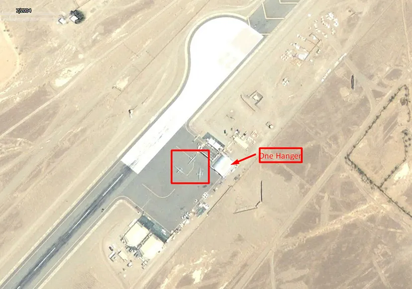
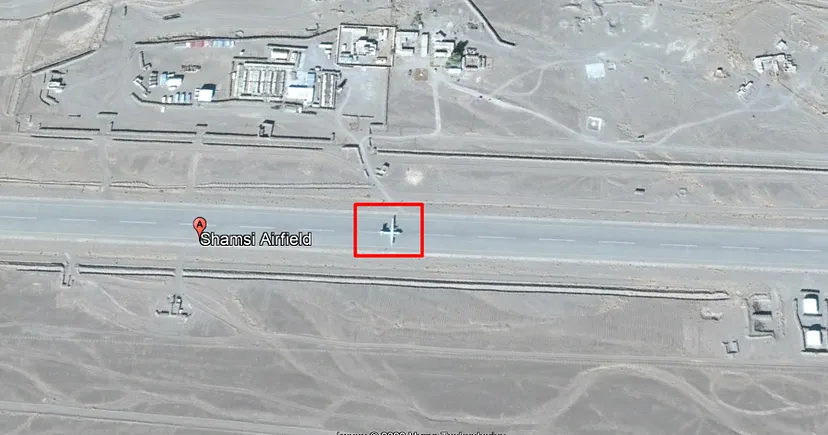
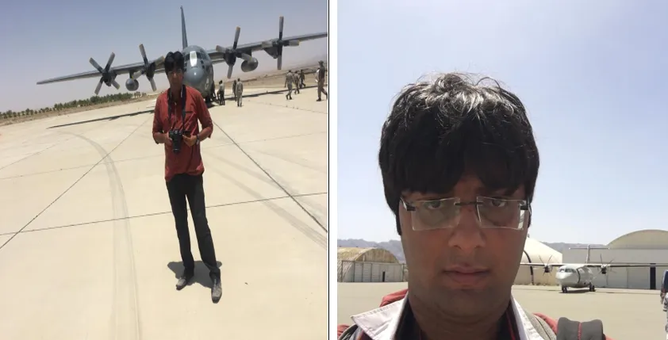

## Starting

You might think that like other blogs and reports on Shamsi Airbase, this will be same. But no, We may have something more interesting.
We will be covering the start of operations of US in Shamsi Airfield till end.
So, lets get on to OSINT.

We start with the never seen imagery of US Troops in Shamsi Air Base.

## History

Shamsi Airbase was seen in news in 2009 when the Times investigation reported unexplained delivery of 730,000 gallons of F34 aviation fuel to the Airbase whose details were found on the website of the Pentagon’s fuel procurement agency.

Google Imagery of July 2004 proves the presence of drones on Shamsi airfield and US and Pakistan state officials both denied such thing at start.

Now we move on to the terrestrial Importance of the Airbase:
Shamsi was important to US because predator drones can easily takeoff from there and reach Afghanistan in less than an hour.

There is a history of KC-130 crash near the mountains of Washuk, Balochistan.

On Jan 9, 2002, following an uneventful flight from Jacobabad, the crew started a night approach to Shamsi AFB. While descending in limited visibility at the altitude of 3,200 feet, the four engine aircraft struck the slope of a mountain located few km from the airfield. All seven members of the crew died.

It is believed that the crew lost its orientation while approaching Shamsi AFB by night and without any visual references on ground.

At that Pakistan was in the era of Pervez Musharraf and the government of that time hid this from general public.

These comments shows how Pasni, Shamsi, and Jacobabad were the safe heavens for US troops in 2000.

Current Status of Shamsi Airbase:

OSINT analysis shows that Shamsi is still used by Pakistan Airforce and private airlines but very less. These images from various platforms confirm this point.

A private plane spotted in 2014 imagery.

Latest Imagery and photos.

Very Seldom evidences of regular use.

A PAF C-130 and SAAB 2000 at Shamsi Airbase.

